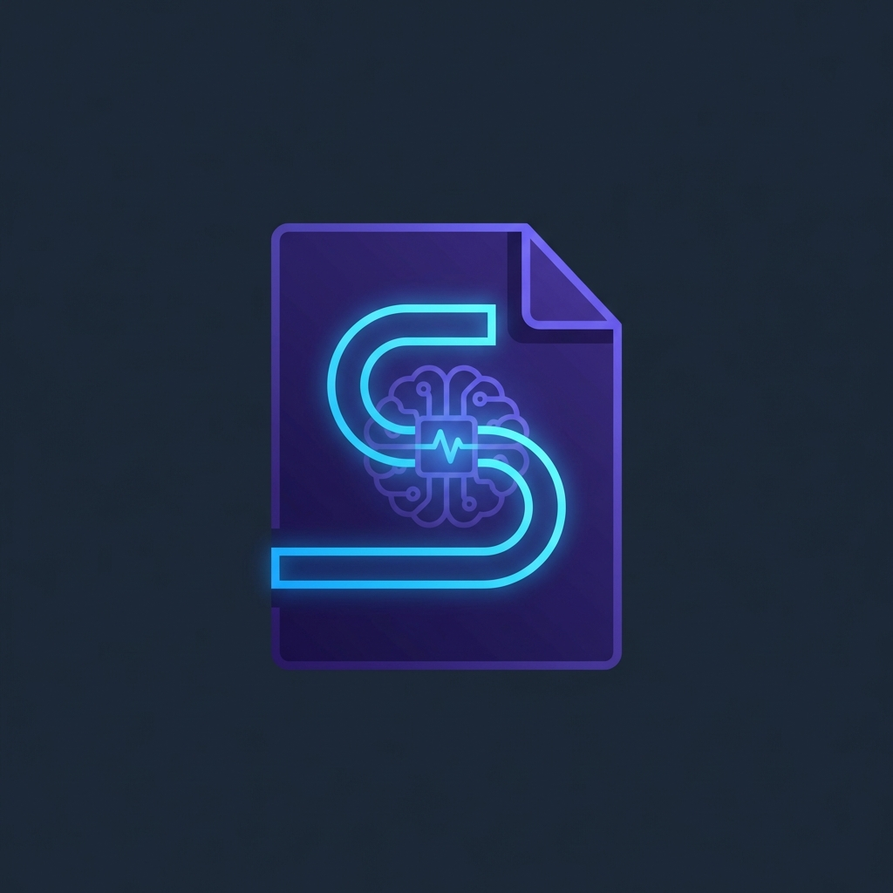
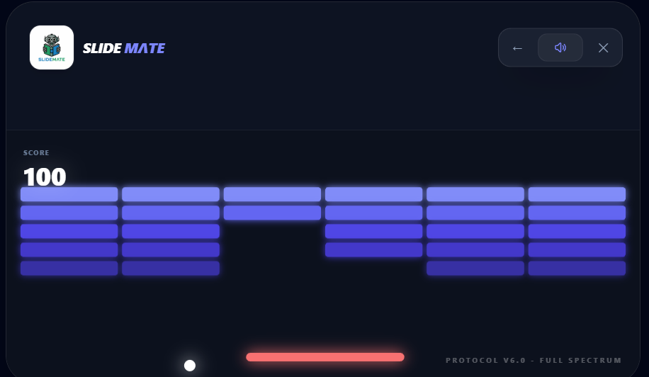
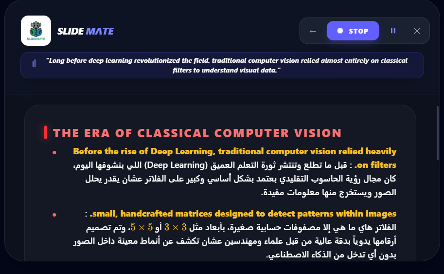
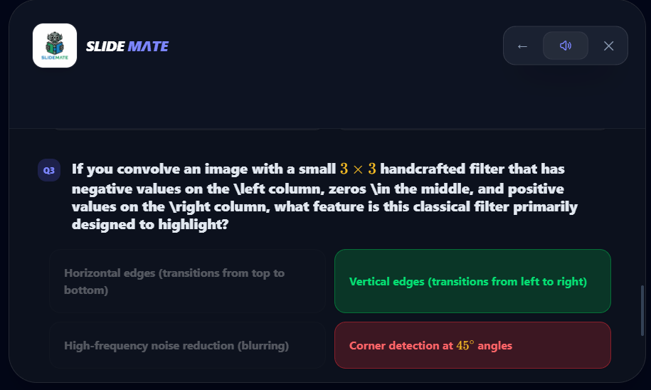
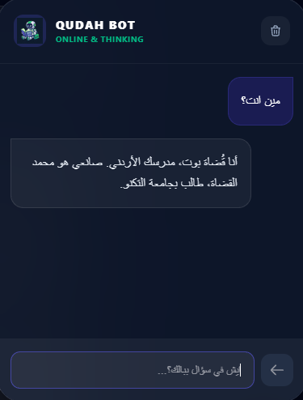
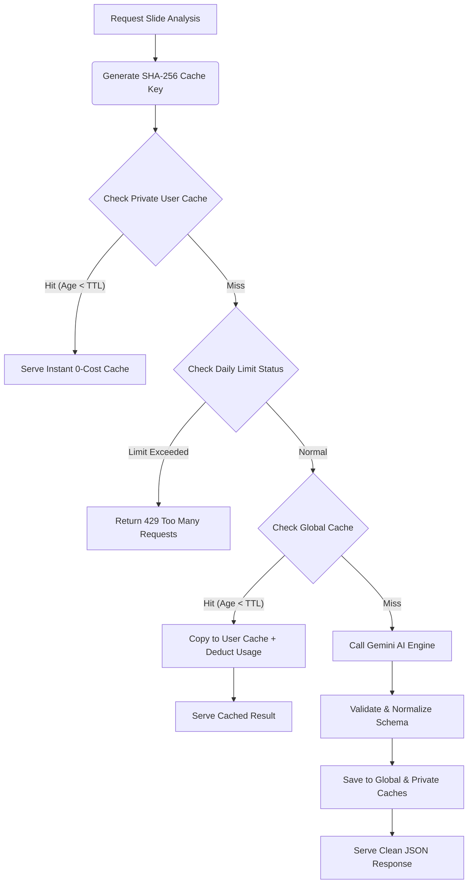

# 🚀 SlideMate AI
### *The Ultimate AI Study Partner | Powered by the "QudahWay"*

<p align="center">
  
</p>

**SlideMate AI** is a state-of-the-art learning platform designed to transform boring, passive lecture slides into an active, engaging, and personalized tutoring experience. It bridges the gap between dry academic content and real student understanding using the unique **"QudahWay"**—a persona-driven tutoring style that speaks the student's language (friendly Jordanian Arabic) while maintaining high academic standards.

---

## 🌟 Visual Tour & User Flow

Here is how SlideMate AI transforms your studying experience, step-by-step:

### 1. The Dashboard (Modern Glassmorphism UI)
Drop your lecture PDFs or slides into the futuristic drag-and-drop zone. The UI is built using a dark glassmorphic design that is pleasing to the eyes during late-night study sessions.
<p align="center">
  
</p>

### 2. The Waiting Arcade (No More Boring Loaders!)
Lecture slides can be large, and processing them takes time. Instead of showing a boring loading spinner, SlideMate lets you play retro mini-games (`NeuralSnake`, `AstroJump`, `CyberBricks`, or `MemoryGame`) directly in the browser to keep you entertained!
<p align="center">
  
</p>

### 3. Interactive "QudahWay" Explanations
Once processed, your slide is shown on the left, and the AI explanation is on the right. 
- **Ammiya dialect** (Jordanian Arabic) makes you feel like your top-tier friend is explaining it to you.
- Full **LaTeX integration** ensures math, equations, and steps are rendered beautifully.
<p align="center">
  
</p>

### 4. Exam Mode (Custom Quizzes & MCQs)
Generate highly accurate Multiple-Choice Questions (MCQs) tailored to the slide's content. Test yourself, get instant visual feedback on your answers, and read thorough English explanations of why an answer is right or wrong.
<p align="center">
  
</p>

### 5. Chat with your Jordanian Mentor
Got a follow-up question? Or just want to talk? The interactive chat panel allows you to talk directly with the tutor.
<p align="center">
  
</p>

> [!TIP]
> **💬 الروح الأردنية (The Jordanian Soul):**  
> البوت مش مجرد آلة حاسبة أكاديمية جافة! لو سألته **"مين انت؟"** ما رح يجاوبك إجابة روبوتية مملة مثل *"أنا نموذج ذكاء اصطناعي..."*، بل رح يجاوبك كصديق ومهندس أردني شهم بلهجة عمّانية أصيلة، ويحسسك إنه قاعد جنبك بالجامعة وبدعمك بكل خطوة!

---

## ⚡ Core Features

*   **🧠 Simple Mode**: In-depth concepts breakdown. Explains bullet points thoroughly in Jordanian Arabic, providing the background, the "Why", and the "How".
*   **👁️ Visual Mode**: Analyzes diagrams, flowcharts, tables, and graphs in detail, extracting the underlying logic and context rather than just describing the image.
*   **🎮 Waiting Room Arcade**: Built-in interactive HTML5 retro games so you can game while the AI works in the background.
*   **⚡ Premium Tier**: Seamlessly integrates Firebase auth and payment/tier gating (Free vs. Premium limits, custom TTL caches).

---

## ⚙️ Under the Hood: Deep Technical Details

### 1. 2-Tier Caching System (API Cost & Token Optimization)
To optimize response times and minimize LLM token costs, SlideMate AI features a highly efficient caching pipeline using Firestore:



*   **SHA-256 Fingerprinting (`getAnalysisCacheKey`)**:
    The system generates a unique hash based on a version token (`v60`), the array of slide numbers, text contents, the requested mode, and the thumbnail.
    > [!IMPORTANT]  
    > **Device-Independent Cache Key**: If text content is successfully extracted from the slide, the system **ignores the thumbnail in the hash calculation**. This ensures that users scanning the same slide on different screen resolutions or mobile vs. PC browsers still get cache hits!
*   **Cache Retention (TTL)**:
    *   **Free Tier**: Analyses expire after **2 days** to maintain database hygiene.
    *   **Premium Tier**: Analyses remain cached for **30 days** (`CACHE_TTL_DAYS = 30`).
*   **Private vs. Global Scope**:
    *   *Private Cache* (`/users/{uid}/analyses/{cacheKey}`): Free to access. Re-visiting your own slide costs **0 points**.
    *   *Global Cache* (`/global_analysis_cache/{cacheKey}`): Shared across all users. If user A already processed a slide, user B gets the cached result instantly, avoiding new LLM charges, and costing user B only 1 daily usage point.

### 2. Frontend Architecture
*   **React 19 + TypeScript + Vite**: Built on modern hooks and context providers (e.g., `AuthContext` for tier tracking).
*   **Glassmorphic UI**: Styled using Tailwind CSS v4.0. It incorporates layered backdrops, custom blurs (`backdrop-blur-md`), and neon theme accents to deliver a premium IDE-like feel.
*   **Waiting Room State Machine**: While waiting for the API promise to resolve, a state switcher mounts one of 4 HTML5 canvas-based games (`NeuralSnake`, `AstroJump`, `CyberBricks`, `MemoryGame`). This makes processing wait times feel like play times.

### 3. Backend & AI Pipeline (Vercel Serverless)
*   **Node.js Serverless Functions**: Located under `/api/`, utilizing the `@google/generative-ai` and `@vercel/node` packages.
*   **Self-Healing JSON Shape Repair (`repairExamJsonShape`)**:
    LLMs can sometimes output invalid JSON structure for MCQ arrays. SlideMate features a self-correcting routing function that detects bad schemas and automatically feeds the malformed output back through Gemini 3.5 Flash to enforce the strict MCQ TypeScript schema.
*   **Hybrid OCR Fallback**:
    Text is extracted on the client side using Tesseract.js. For complex slides with diagrams or text-embedded tables, the server falls back to Gemini 3.1 Flash-Lite Vision (`extractSlideContentWithGemini31`) to parse visual elements directly.

---

## 🏗️ AI Model Matrix
We employ a **Best-of-Breed** model routing strategy to optimize speed, cost, and reasoning capability:

| Task / Feature | Model | Provider |
| :--- | :--- | :--- |
| **Arabic Logic & Explanations** | `gemini-3.5-flash` | Google AI |
| **Visual Reasoning (Diagrams/Tables)** | `Llama-4-Scout-17b` | Meta (via Groq) |
| **OCR Fallback Parsing** | `Llama-4-Scout-17b` | Meta (via Groq) |
| **English MCQ Reasoning Generation** | `Llama-3.3-70b` | Meta (via Groq) |
| **Voice Synthesis (TTS)** | Google Translate TTS | Public Endpoint |

---

## 📂 Project Structure

```text
SlideTutor-AI/
├── api/                  # Vercel Serverless Functions
│   ├── analyze.ts        # Main AI logic, caching, and prompt engineering
│   ├── chat.ts           # Interactive chatbot endpoint
│   ├── firebaseAdmin.ts  # Admin Firebase SDK setup
│   └── tts.ts            # Text-to-Speech synthesizer
├── src/                  # Frontend Source Code
│   ├── components/       # UI Components (Explanation, Games, Auth, Dashboard)
│   │   ├── AstroJump.tsx     # Retro jump game
│   │   ├── CyberBricks.tsx   # Brick breaker game
│   │   ├── NeuralSnake.tsx   # Cyberpunk snake game
│   │   └── ExplanationPane.tsx # Explanations & Quizzes panel
│   ├── contexts/         # Global States (Auth, User Tiers)
│   └── main.tsx          # Application entrypoint
├── public/               # Static assets & screenshots
│   └── screenshots/      # README visual assets
├── vercel.json           # Serverless Routing config
├── tailwind.config.js    # Styling design tokens
└── package.json          # Node dependencies
```

---

## 🛠️ Installation & Setup

### 1. Environment Setup
Create a `.env` file in the root directory:
```env
GROQ_API_KEY=your_groq_api_key
GEMINI_API_KEY=your_gemini_api_key
FIREBASE_SERVICE_ACCOUNT=your_firebase_service_account_json_oneline
```

### 2. Run Locally
```bash
# 1. Install dependencies
npm install

# 2. Run Vite frontend dev server
npm run dev

# 3. Run Vercel Serverless locally (for API endpoints)
npx vercel dev
```

### 3. Deploying to Cloudflare Pages
To build and deploy the production build to Cloudflare Pages:
```bash
# Build the project
npm run build

# Deploy to Cloudflare Pages
npx wrangler pages deploy dist
```

---
*Developed with ❤️ by **Mohammad Qudah***.  
*SlideMate AI: Study smarter, study the "QudahWay".*
